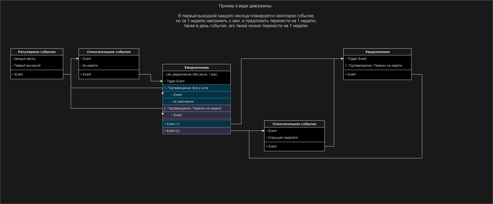

# LiCo
### Виденье проекта
LiCo - это приложение для менеджмента личного времени. 
Сочетает в себе функционал календаря и трекера задач.
Позволяет удобно планировать распорядок дня, 
    управлять периодическими и произвольными событиями.
Имеет гибкую настройку с визуальным (нодовым) конфигуратором, что позволяет:
  - пошаговое выполнение задачи
  - настройка условий и периодичности
  - различные логические связи


*Пример нодовой связи*


Пример задачи:
  1. раз в две недели на выходных планировать поездку на дачу
  2. иметь возможность в один клик перенести на следующую неделю
  3. заранее предупреждать о дожде и плохой погоде
  4. в этом случае, предлагать перенести

> Вполне вероятно, что это избыточный вариант (по крайней мере для MVP),
> тк для получения данных о погоде, скорее всего, придется использовать сторонние сервисы.

### Quick start
1. Установить зависимости

```bash
npm install
```

2. Запустить проект

```bash
npm run electron:dev
```

3. Собрать проект

```bash
npm run electron:build
# это создаст папку build со собранным приложением
```

### Структура проекта
Проект представляет собой десктопное приложение,
   построенное на Electron.js бекенде и React.js фронтенде.
- `src/renderer` - React.js фронтенд.
- `src/main` - Electron.js бекенд.
- `src/preload` - скрипты, связывающие Electron.js и React.js.
- `src/common` - общие для фронтенда и бекенда файлы (типы, константы).
- `out` - сбилженные файлы и ассеты.
- `build` - собранное desktop приложение, установщики и тп.
- `resouces` - ресурсы используемые при сборке и в приложении.
- `docs` - документация проекта.

### Архитектурный подход в react.js приложении
Используется методология [FSD2](https://feature-sliced.design/ru/),
    со следующей файловой структурой:

Слои:

  - `app` - точка входа, общая конфигурация приложения
  - `pages` - компоновка приложения
  - `widgets` - самодостаточные компоненты
  - `features` - компоненты с пользовательским функционалом
  - `entities` - определение бизнес-сущностей, и ui для представления данных 
  - `shared` - ui-компоненты, утилиты, константы, общие стили и тп

Сегменты:

  - `ui` - компоненты и отображение
  - `react` - хуки, контексты и другой react-специфичный код,
               который оперирует над моделью
  - `model` - бизнес-логика, обработка данных, состояние
  - `types` - определение сущностей и типов

> Пу сути, в отличие от классической FSD, в данном проекте (из-за его простоты
> и небольшого размера) ui в entities может и не выносится,
> а оставаться на уровне widgets или features.


Дополнительные ограничения:
  - слои `entities` и `features` не знают о роутинге
  - `default exports` не используются
